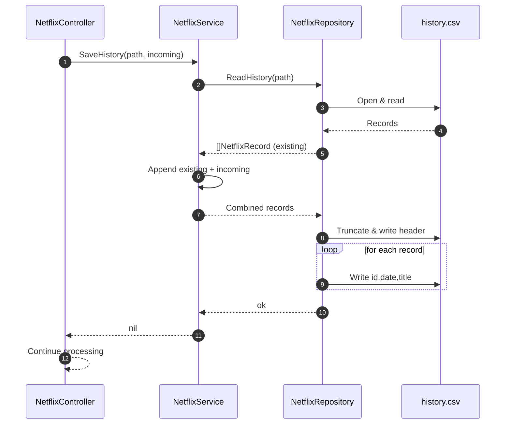

# シーケンス — SaveHistory による履歴更新

```mermaid
sequenceDiagram
autonumber
participant Ctrl as NetflixController
participant Svc as NetflixService
participant Repo as NetflixRepository
participant Hist as history.csv

Ctrl->>Svc: SaveHistory(path, incoming)
Svc->>Repo: ReadHistory(path)
Repo->>Hist: Open & read
Hist-->>Repo: Records
Repo-->>Svc: []NetflixRecord (existing)
Svc->>Svc: Append existing + incoming
Svc-->>Repo: Combined records
Repo->>Hist: Truncate & write header
loop for each record
    Repo->>Hist: Write id,date,title
end
Repo-->>Svc: ok
Svc-->>Ctrl: nil
Ctrl-->>Ctrl: Continue processing
```
