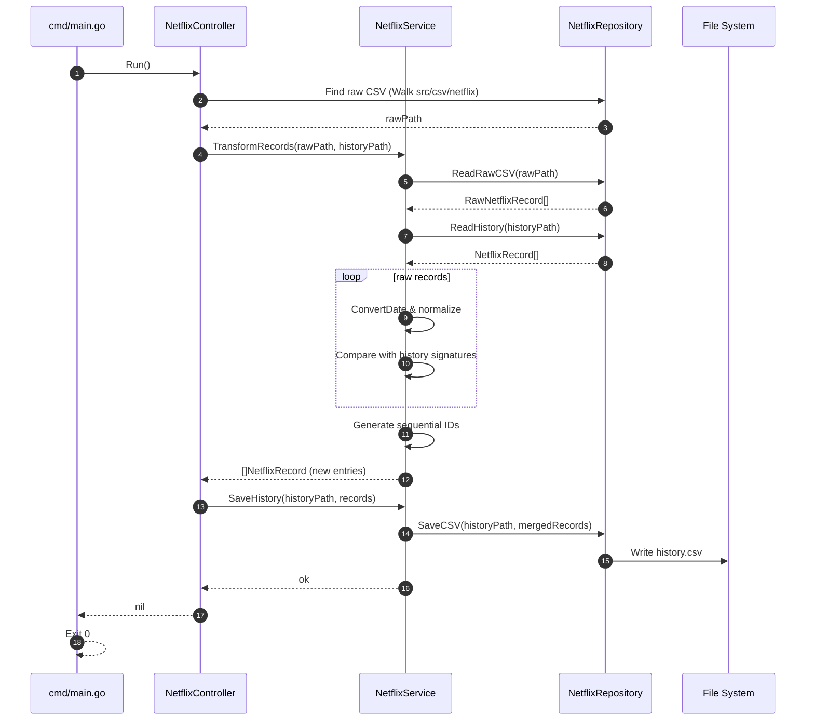

# シーケンス — 実行全体フロー

```mermaid
sequenceDiagram
autonumber
participant CLI as cmd/main.go
participant Ctrl as NetflixController
participant Svc as NetflixService
participant Repo as NetflixRepository
participant FS as File System

CLI->>Ctrl: Run()
Ctrl->>Repo: Find raw CSV (Walk src/csv/netflix)
Repo-->>Ctrl: rawPath
Ctrl->>Svc: TransformRecords(rawPath, historyPath)
Svc->>Repo: ReadRawCSV(rawPath)
Repo-->>Svc: RawNetflixRecord[]
Svc->>Repo: ReadHistory(historyPath)
Repo-->>Svc: NetflixRecord[]
loop raw records
    Svc->>Svc: ConvertDate & normalize
    Svc->>Svc: Compare with history signatures
end
Svc->>Svc: Generate sequential IDs
Svc-->>Ctrl: []NetflixRecord (new entries)
Ctrl->>Svc: SaveHistory(historyPath, records)
Svc->>Repo: SaveCSV(historyPath, mergedRecords)
Repo->>FS: Write history.csv
Svc-->>Ctrl: ok
Ctrl-->>CLI: nil
CLI-->>CLI: Exit 0
```
